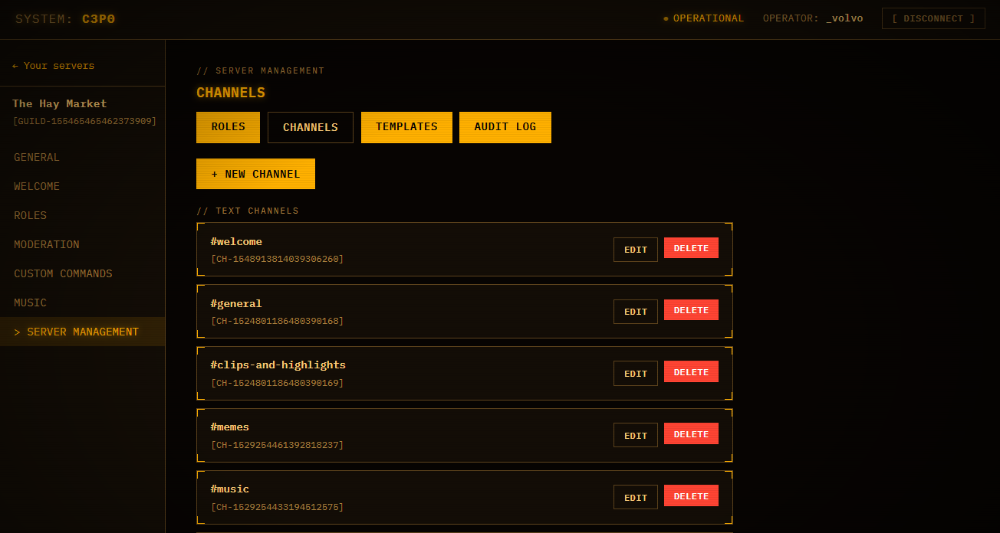

# C3P0 

###### This project was developed with the use of Artificial Intelligence as a learning/research project. 
###### I wholeheartedly recommend [Cog-Creators/Red-DiscordBot](https://github.com/Cog-Creators/Red-DiscordBot) if you are not interested in using a project developed with the assistance of Artificial Intelligence.

##

Python · Docker Compose · SQLite. 
C3P0 is a simple Discord bot that runs on your hardware — a home server, a VPS, a Raspberry Pi. Not someone else's cloud.

[](https://github.com/cm208/c3p0/actions/workflows/ci.yml)
[](https://github.com/cm208/c3p0/releases)


---

## What it is

Most Discord bots ask you to choose between two bad options: a hosted service that holds your server's data, or a self-hosted bot configured by editing YAML and restarting a container every time you change your mind.

C3P0 is neither. It runs entirely on your hardware, and everything is configured at runtime — from Discord with slash commands, or from a web dashboard you log into with your own Discord account. There is no config file to edit after the first five minutes of setup.

```
┌──────────────┐          ┌──────────────┐
│   Discord    │          │  Dashboard   │
│  (slash +    │          │ (OAuth2 web  │
│   prefix)    │          │      UI)     │
└──────┬───────┘          └──────┬───────┘
       │                         │
       └──────────┬──────────────┘
                  ▼
           services  →  repositories  →  SQLite
```

Both front ends call the same service layer, so a rule enforced in Discord is the same rule enforced in the browser. No duplicated logic, no drift between the two.

## Features

### From Discord

| Area | What you get |
| --- | --- |
| **Welcome** | Channel messages or DMs, embed or plain text, template variables, automatic default role, join logging |
| **Self-assignable roles** | Reaction roles, button roles, and select-menu roles — all creatable without leaving Discord |
| **Moderation** | `kick` · `ban` · `unban` · `timeout` · `warn` · `warnings` · `clear` · `slowmode` · `lock` · `unlock`, with persistent infractions and configurable auto-escalation on repeat offenses |
| **Custom commands** | Template-only responses with cooldowns, role restrictions, and embed toggles — never arbitrary code execution |
| **Music** | YouTube and Spotify links (resolved to audio automatically) or plain search terms, per-guild queues with requester attribution, shuffle and loop, DJ-role gating |

### From the dashboard

Log in with Discord OAuth2 and you see exactly the servers where you already hold **Manage Server** — no more, no less. Every feature area above gets a full settings page, and music gets **live** now-playing, queue, and transport controls rather than configuration toggles alone.

The UI is an amber-phosphor "ops console" theme. It does not look like a generic admin panel, which is the point.



*Server management — channel list, with the roles / templates / audit log tabs alongside it.*

### Server management

The dashboard manages the server's actual structure, not just the bot's behavior inside it:

- **Roles and channels** — create, edit, delete, and drag-and-drop reorder, both backed by a stage-then-apply canvas so a batch of changes lands as one Discord API pass, not one call per edit.
- **Permission overwrites** — per-role allow/deny on any channel, using Discord's real overwrite model. This is how you stand up a staff-only area.
- **Templates** — preview a built-in starter layout before applying it, or save your current structure as a template and reuse it on the next server.
- **Audit log** — every change, who made it, and when.
- **Infraction management** — a searchable, sortable, paginated moderation log, with a per-infraction page to correct a reason or remove a bad entry.

This is the difference between a bot with a web UI attached and a real server-configuration tool.

## Security posture

C3P0 is built to be exposed to the public internet, not just trusted on a LAN.

- **No privilege escalation.** The dashboard can never grant a permission the person using it does not already hold. Hierarchy checks run on every role and moderation action, for the acting user *and* for the bot.
- **Custom commands are templates.** They render text. There is no eval path.
- **Destructive actions require confirmation.** Role and channel deletion is irreversible the instant Discord receives it, and the UI treats it that way.
- **No privileged containers,** no host networking, no Docker socket mount. The bot's internal control-plane API is never published to the host — it is reachable only over the Compose network, behind a bearer token.
- **690+ automated tests** across services, repositories, cogs, and web routes.

---

# Quickstart

Self-hosted means you run it. Budget about fifteen minutes, most of it on Discord's website.

**Requirements:** Docker with the Compose plugin, and a machine that stays on. Prebuilt images are published for `amd64` and `arm64`, so a Raspberry Pi works.

### 1. Create the Discord application

At [discord.com/developers/applications](https://discord.com/developers/applications), create an application and add a bot user. Under **Bot → Privileged Gateway Intents**, enable both:

- Server Members Intent
- Message Content Intent

Both are required. Copy the bot token, and note the Application ID from the General Information page. The full walkthrough is in [docs/discord-setup.md](docs/discord-setup.md).

### 2. Configure

```bash
git clone https://github.com/cm208/c3p0.git
cd c3p0
cp .env.example .env
```

Fill in `.env`:

| Variable | Required | Notes |
| --- | --- | --- |
| `DISCORD_TOKEN` | yes | Bot token from the developer portal |
| `DISCORD_APPLICATION_ID` | yes | Doubles as the OAuth2 client ID |
| `INTERNAL_API_TOKEN` | yes | Shared secret between bot and dashboard. `openssl rand -hex 32` |
| `DEFAULT_PREFIX` | no | Defaults to `!`, overridable per guild later |
| `DISCORD_CLIENT_SECRET` | dashboard | OAuth2 client secret |
| `PUBLIC_BASE_URL` | dashboard | Exact public URL, no trailing slash. Must byte-for-byte match the redirect URI you register as `${PUBLIC_BASE_URL}/auth/callback` |

Everything else in `.env.example` has a working default.

### 3. Start the bot

```bash
docker compose pull
docker compose up -d c3p0
docker compose logs -f c3p0
```

Database migrations run automatically on startup. Wait for `Bot ready`. To build from source instead of pulling the image, use `docker compose up -d --build c3p0`.

### 4. Invite the bot

Open this link, with your Application ID filled in, and pick your server:

```
https://discord.com/oauth2/authorize?client_id=YOUR_APPLICATION_ID&scope=bot+applications.commands&permissions=1099783302230
```

Then run `/config show` in Discord to confirm it's alive. Drag the bot's role above any roles it should manage, and see [docs/discord-setup.md](docs/discord-setup.md) for what each permission is for and how to make slash commands appear instantly.

### 5. Dashboard (optional)

The bot is fully usable from Discord without the dashboard. To add it, set `DISCORD_CLIENT_SECRET` and `PUBLIC_BASE_URL` in `.env`, register `${PUBLIC_BASE_URL}/auth/callback` as an OAuth2 redirect in the developer portal, put HTTPS in front of port `8180` (a reverse proxy or a Cloudflare Tunnel), then run `docker compose up -d`. The dashboard container exits if those two variables are missing, which is why step 3 starts only the bot. Details in [docs/web-dashboard.md](docs/web-dashboard.md).

> Running locally over plain HTTP? Set `WEB_COOKIE_SECURE=false`. Never do this in production.

### Updating

```bash
docker compose pull
docker compose up -d
```

Backups, pinning a version, and troubleshooting are in [docs/deployment.md](docs/deployment.md).

# Usage

Configuration lives in Discord and the dashboard — environment variables are for secrets and infrastructure only.

**Slash commands** (admin configuration)

```
/config show | prefix
/welcome enable | disable | channel | message | role | embed … | show
/reactionrole, /rolebutton, /roleselect     create, add, remove, list
/moderation escalation enable | set | clear | show
/customcommand create | edit | delete | restrict | cooldown | list
```

**Prefix commands** (day-to-day, `!` by default)

```
Moderation   !kick  !ban  !unban  !timeout  !warn  !warnings
             !clear  !slowmode  !lock  !unlock
Music        !join  !leave  !play  !pause  !resume  !skip  !stop
             !queue  !volume  !shuffle  !loop
```

### Local development

```bash
python -m venv .venv
source .venv/bin/activate
pip install -e ".[dev]"
cp .env.example .env      # fill in DISCORD_TOKEN
python -m app
```

```bash
pytest
ruff check .
```

After changing a model, generate a migration and read it before committing — autogenerate is a starting point, especially on SQLite:

```bash
alembic revision --autogenerate -m "describe the change"
```

### Documentation

`docs/deployment.md` · `docs/discord-setup.md` · `docs/web-dashboard.md`

### License

MIT. C3P0 is a personal project name; no copyrighted franchise artwork, logos, or dialogue is packaged with it.
